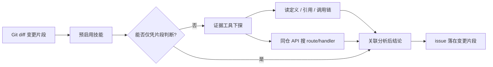

# Smart Review

> 语言 / Language: [中文](README.md) | [English](README.en-US.md)

🚀 **AI 智能代码审查工具** — 静态规则秒级扫雷，模型带证据下探定义与调用链；CLI 随时审、Hook 自动拦，安全、逻辑与契约问题一次看清。

## ✨ 特性

- 🔍 **静态规则检测** - 安全 / 性能 / 最佳实践（安装后含完整规则模板）
- 🧠 **AI 智能分析** - OpenAI / Anthropic / Gemini；关注安全漏洞、逻辑缺陷、接口契约、兼容性、性能
- 🧩 **审查技能 + 证据下探** - 预启用证据溯源、安全深挖、逻辑/契约/性能等；模型可读定义、引用、调用链
- 🔗 **同仓 API 契约溯源** - 前端 `fetch`/`axios` 可下探后端 route/handler/DTO，核对方法、路径与必填参数
- 🛡️ **深层安全分析** - 注入/鉴权/IDOR/SSRF/反序列化等清单，不限于 auth 目录
- ⚡ **Git Diff 增量审查** - 默认只审新增行；`--files` 无变更时回退整文件，`--full` 强制整文件
- 🚀 **按需分批/分段** - 仅在配置了 `maxRequestTokens` / `maxFilesPerBatch` 时拆批或分段
- 🎯 **Git Hook 集成** - pre-commit 暂存区审查
- 📁 **多语言文件** - JS/TS/Vue/Python/Java/Go 等
- ⚙️ **高度可配置** - 规则、风险等级、工具预算、外置 skills / ai-rules
- 🌍 **国际化输出** - 终端与模型最终答案跟 `locale`；发给模型的内部提示固定英文

## 📦 安装

在项目中安装 smart-review，安装后会自动初始化配置并集成到 git pre-commit 钩子：

### 使用 npm
```bash
npm install --save-dev smart-review
```

### 使用 yarn
```bash
yarn add --dev smart-review
```

> 💡 安装完成后，工具会自动：
> - 创建 `.smart-review` 配置目录和配置文件
> - 设置 git pre-commit 钩子，在每次提交时自动进行代码审查

## 🚀 快速开始

### 1. 自动初始化
安装完成后，工具会自动创建配置目录和文件。如需手动重新初始化：
```bash
node bin/install.js
```

初始化后的目录结构：

```
.smart-review/
├── smart-review.json   # 主配置文件
├── ai-rules/           # 用户自定义 AI 提示（原文注入）
├── skills/             # 可选：外置文档型技能
└── local-rules/        # 本地静态规则（安装时从模板复制）
    ├── security.js
    ├── performance.js
    └── best-practices.js
```

### 默认审查画像

不额外改配置时，大致是：

| 项 | 默认 |
|----|------|
| 范围 | Diff 增量（`reviewOnlyChanges: true`）；只审 `+` 行 |
| 技能 | 证据溯源、API 契约溯源、深层安全、逻辑、接口契约、性能、运行时兼容等（见 [高级审查能力](#-高级审查能力默认开箱即用)） |
| 工具 | `tools.strategy: conservative`（约 6 次）+ `evidenceMaxCalls: 12` |
| 分段 | 未配 `maxRequestTokens` 则不分段 |
| Loop / 修复闭环 | 默认关闭 |
| 静态命中阻断 | `runWhenBlocked: false` 时可能跳过 AI |

### 🎯 高级审查能力（默认开箱即用）

除静态规则与「只看 diff 片段」外，Smart Review 默认预启用一批**维度技能**和**文档型技能**，并在 diff 模式下打开**证据下探工具**（`tools.strategy: conservative`）。模型可以读仓库里的定义与引用，做**关联分析**，而不只凭片段猜测。

> 发给模型的内置技能与工具说明为英文；下面用中文概括能力。终端输出与问题描述仍跟 `locale`。

#### 1. 证据溯源与关联分析（`evidence-trace`）

**解决什么问题**：变更里调用了某个函数、读了某个配置、发了一次 HTTP 请求——单看 `+` 行往往无法判断是否真的有问题。

**会怎么做**：

- 从**本次变更片段**出发，用只读工具追符号定义、参数契约、错误处理、配置含义
- **关联分析**：`find_references` 查定义/引用，`trace_callers` 看「谁调用了它、这次改动会影响谁」
- 被读到的旧代码仅作**证据**，不会把 callee 里原本就存在、与本次改动无关的历史问题当成新 issue

**典型场景**：

| 场景 | 示例 |
|------|------|
| 新增/修改函数调用 | 改了 `login()` 入参，需读 `validateUser` 是否校验租户 |
| 新 import / 类型 / 配置 | 新用了某个 DTO 字段，需读定义确认必填与类型 |
| `import type` | 类型在编译期擦除，仍要读类型定义文件，避免契约不一致被漏掉 |
| Monorepo workspace 包 | `@scope/shared/foo` 等内部包 import，需追到 workspace 内源文件 |
| 生成物（pb/grpc 等） | 审查本次对生成符号的**用法**；改契约时追 `.proto`/schema，不以生成文件为主审查对象 |
| 错误处理是否覆盖 | callee 可能抛错，本次分支是否遗漏 catch |
| 可达性变化 | 本次改动是否让旧路径在新输入下被触发 |

**常用工具链**：`resolve_import` → `read_symbol_context` / `read_around` → `find_references`（可传 `fromPath`，优先同文件/同目录，压制同名符号）→ `trace_callers`；仍失败则 `search_in_repo`。

**导入解析（零配置）**：`resolve_import` 自动读取 tsconfig/jsconfig（含 `extends`）、Vite/Webpack/Nuxt 别名（`@/`、`~/`、`#/`）、pnpm/npm **workspace 包**、barrel `export … from`（最多 2 跳），以及 Python / Go（含 `internal/`）/ Java / PHP 等 import。**无需**在 `smart-review.json` 里配置路径别名。

#### 2. 同仓 API 契约溯源（`api-boundary-trace`）

**解决什么问题**：前后端在同一仓库（monorepo）时，前端改了 API 调用，或后端改了 route/DTO/校验，单文件审查容易漏掉**跨端契约不一致**。

**会怎么做**：

1. 从变更片段提取：`method`、路径、query/body/header 参数名
2. `search_in_repo` 定位后端 `@Get` / `router.post` / handler / OpenAPI 片段
3. `read_around` / `read_symbol_context` 读 DTO、required 字段、校验逻辑
4. 若审的是**后端签名变更**：再用 `find_references` / `trace_callers` 找仓库内调用方是否仍匹配

**核对项**：HTTP 方法、路径、必填参数、类型/枚举、可见的鉴权头是否缺失。

**报告原则**：issue 仍落在**本次变更的文件/片段**上；定义侧内容只作证据引用。找不到 in-repo 定义时会报 Medium「需人工确认」，不会默默当成通过。

**示例**：

- ✅ 前端新增 `POST /api/order` 未传 `userId`，handler 要求必填 → 报在前端调用片段
- ✅ 后端把 `userId` 改为必填，仓库内前端调用仍省略 → 报在后端变更（附调用方证据）
- ❌ 下探时在 handler 里看到无关旧日志 → **不报**（非本次引入）

#### 3. 深层安全分析（`security-deep`）

**解决什么问题**：通用 diff 审查容易漏掉 OWASP 类、权限边界、出站请求等**系统性安全风险**。

**额外检查清单**（不限 auth 目录；任何新输入面、鉴权、出站网络、敏感数据都适用）：

| 类别 | 关注点 |
|------|--------|
| 注入 | SQL/NoSQL/命令/LDAP/模板注入 |
| 鉴权 | 身份/权限、水平/垂直越权、IDOR |
| 敏感数据 | 硬编码密钥、日志泄露；测试里像真密钥的值仍按 High |
| 会话 | Cookie HttpOnly/Secure/SameSite、固定/失效 |
| 输入校验 | 长度、类型、白名单、上传路径 |
| SSRF | 用户可控 URL 访问内网或 metadata |
| 反序列化 | 不可信数据进入反序列化或对象合并 |
| CORS / 重定向 | 过宽 CORS、开放重定向 |

每条 issue 需含：路径、片段、风险原因、可执行修复建议；不因「需人工确认」或测试路径自动降为 Suggestion。

#### 4. 其他默认预启用能力

| 技能 | 作用 |
|------|------|
| `logic-correctness` | 分支、边界、空值、竞态、错误路径 |
| `api-contract` | 方法/路径/载荷契约、幂等、状态码、破坏性兼容 |
| `performance-hotpath` | 热路径上的 N+1、阻塞、多余分配 |
| `runtime-compat` | Node/浏览器/API 版本与运行时差异 |
| `diff-risk-guard` | 只审 `+` 行；被调方历史问题不当成本次新 issue |
| `evidence-enforcer` | 每条 issue 必须有证据片段、风险、原因、建议 |

文档型技能（`evidence-trace`、`api-boundary-trace`、`security-deep`）预启用时会注入**完整检查清单**；一般无需手写 `[SKILL_SELECT]`。外置 `.smart-review/skills/*.md` 可按 `match` 路径追加团队规范。

#### 5. 调优建议

| 需求 | 配置 |
|------|------|
| 同仓 API 多步下探不够 | 提高 `tools.evidenceMaxCalls`（默认 12）或 `tools.strategy: balanced` |
| 暂时关闭工具（省 token） | `tools.strategy: off` 或 `ai.tools.enabled: false` |
| 把静态命中喂给 AI | `includeStaticHints: true` |
| 加深一轮复检 | `loop.enabled: true` |



### 2. 基本使用

#### 审查暂存区文件（Git Hook）
```bash
node bin/review.js --staged
```

#### 审查指定文件
```bash
node bin/review.js --files test/src/test-file.js
node bin/review.js --files test/src/index.tsx,test/src/large-test-file.js
```

#### Git Diff 增量审查模式
启用增量审查模式后，工具会智能识别文件的变更内容，只审查修改的代码行，大幅提升审查效率：

```bash
# 审查暂存区的变更内容（推荐）
node bin/review.js --staged

# 审查指定文件的变更内容
node bin/review.js --files src/modified-file.js
```

**增量审查模式的优势：**
- ⚡ **高效审查** - 只分析变更的代码行，跳过未修改的内容
- 🎯 **精准定位** - 问题报告直接关联到具体的变更行
- 💰 **成本优化** - 减少AI API调用的token消耗
- 🚀 **快速反馈** - 大幅缩短审查时间，特别适合大型项目

**工作原理：**
1. 自动检测Git变更（通过`git diff`）
2. 提取变更的代码行和上下文
3. 只对变更内容进行静态规则检测和AI分析
4. 保持完整的上下文信息，确保分析准确性

#### 大文件分段分析
默认不按 token 分段。只有在配置了 `ai.maxRequestTokens` 时，超过预算的文件才会分段；未配置则尽量整文件送出。
```bash
node bin/review.js --files test/src/large-test-file.js
```

#### 批次处理示例
对于多个文件的批次处理：
```
代码审查审查中，请等待...
🔍 开始分析批次文件: src/utils.js, src/config.js, src/helper.js，预估3200 tokens, 共3 个文件
   ✅ 批次分析完成: src/utils.js, src/config.js, src/helper.js，发现 5 个问题，耗时: 2.3s
当前已完成进度: 1/3，总耗时: 2.3s
🔍 开始分析批次文件: src/api.js, src/database.js，预估2800 tokens, 共2 个文件
   ✅ 批次分析完成: src/api.js, src/database.js，发现 3 个问题，耗时: 1.8s
当前已完成进度: 2/3，总耗时: 4.1s
```

### 3. Git Hook 集成
在 `package.json` 中添加：
```json
{
  "husky": {
    "hooks": {
      "pre-commit": "smart-review --staged"
    }
  }
}
```

#### 中断与终端兼容
- 支持 Git Bash、CMD、PowerShell、常见 IDE 终端
- 审查中按 `q` / `Esc`（或 Ctrl+C）可中断并输出已完成结果
- 用户中断退出码一般为 **130**（SIGTERM 为 143）；中断本身不是「可重试失败」
- 仅当已有阻断级问题，或 AI 审查未完成（空/无效结论）时，才会以失败码结束提交检查

## ⚙️ 配置文件

### 主配置文件 `.smart-review/smart-review.json`

```json
{
  "ai": {
    "enabled": true,
    "provider": "openai",
    "model": "deepseek-chat",
    "apiKey": "your-api-key",
    "baseURL": "https://api.deepseek.com/v1"
  },
  "riskLevels": {
    "critical": { "block": true },
    "high": { "block": true },
    "medium": { "block": true },
    "low": { "block": false },
    "suggestion": { "block": false }
  },
  "locale": "zh-CN"
}
```

未写出的采样/上限字段**不会限制模型**，也不会塞进请求体。需要时再显式配置，例如：

```json
{
  "ai": {
    "temperature": 0,
    "maxResponseTokens": 8192,
    "maxRequestTokens": 8000,
    "maxFilesPerBatch": 10,
    "maxFileSizeKB": 500,
    "concurrency": 3,
    "tools": { "strategy": "conservative", "evidenceMaxCalls": 12 }
  }
}
```

### 配置项说明

#### AI 配置 (`ai`)
- `enabled`: 是否启用AI分析
- `provider`: 模型提供方，支持 `openai`、`anthropic`、`gemini`
- `model`: 对应提供方的模型名称
- `apiKey`: 统一 API 密钥字段（也可通过环境变量注入）
- `baseURL`: API基础URL
- `reviewOnlyChanges`: 是否启用Git Diff增量审查。`true`（默认）时有变更审变更，没有可审变更的文件回退整文件；`--full` 强制整文件
- `maxResponseTokens`: 可选，AI响应最大token数；不配则不传 `max_tokens`
- `maxFileSizeKB`: 可选，超过该大小跳过 AI；不配则不因体积跳过
- `enabledFor`: AI分析支持的文件扩展名
- `includeStaticHints`（或兼容别名 `useStaticHints`）: 是否将静态规则发现作为 AI 上下文
- `maxRequestTokens`: 可选，单次请求 token 预算；不配则不分段、不按 token 拆批
- `minFilesPerBatch`: 批处理最小文件数
- `maxFilesPerBatch`: 可选，每批最多文件数；不配则不按文件数拆批
- `tokenRatio`: Token估算比例
- `chunkOverlapLines`: 分段重叠行数，仅在配置了 `maxRequestTokens` 并实际分段时生效
- `temperature`: 可选采样参数；不配则不发给模型
- `concurrency`: 并发AI请求数量，默认3。`<=1` 串行，`>1` 且存在多个批次时并行
- `skills.enabled`: 是否启用技能大纲
- `skills.path`: 外置技能文档目录（相对 `.smart-review/`，默认 `skills`）
- `tools.strategy`: 工具策略：`off`（关闭）/ `conservative`（默认，约 6 次）/ `balanced`（约 12 次）/ `aggressive`（约 20 次）
- `tools.evidenceMaxCalls`: 证据下探调用上限，默认 **12**（便于同仓 API 多步下探）
- `loop.enabled`: 多轮审查 Loop
- `fixLoop.enabled`: 审查-修复闭环（输出可应用修复代码）
- `fixLoop.autoApply`: 是否自动应用修复并再审查（需 `fixLoop.enabled: true`）

#### 技能机制说明

默认行为与完整能力说明见上文 **[高级审查能力](#-高级审查能力默认开箱即用)**。此处仅补充配置要点：

- 每次审查会带上**技能大纲**；上述技能默认**预启用**，一般无需 `[SKILL_SELECT]`。
- 外置 `.smart-review/skills/*.md`：无 `match` 则每次注入；有 `match` 仅路径命中时注入。
- 问题报告始终落在**本次变更片段**；下探/关联分析所得定义仅作证据。

#### AI 只读工具（含证据下探）

基础工具：`read_file`、`get_staged_diff`、`list_files`、`search_in_file`、`get_file_outline`、`search_in_repo`、`list_changed_files`、`get_file_diff`。

证据溯源额外可用：`resolve_import`（**自动**读取 tsconfig/Vite/Webpack/Nuxt、`@/`/`~/`/`#/` 别名、pnpm/npm workspace、barrel 再导出、go.mod/composer 等；支持 Python/Go/Java/PHP 等 import）、`read_around`、`find_references`（建议传 `fromPath` 降噪同名符号）、`trace_callers`、`read_symbol_context`。`import type` 与 pb/grpc 等生成物的溯源策略已写入内置 prompt。解析不到时会提示 AI 用 `search_in_repo` 继续溯源——**无需在 smart-review.json 里配置别名**。

可用 `ai.tools.allow` 收窄列表；未开证据技能且 `strategy: off` 时可不启工具。
#### 风险等级配置 (`riskLevels`)
- `critical`: 致命风险
- `high`: 高危风险
- `medium`: 中危风险
- `low`: 低危风险
- `suggestion`: 建议性问题

每个等级可配置 `block` 属性，决定是否阻断提交。

#### 输出控制配置 (`suppressLowLevelOutput`)
- `true`: 仅输出阻断等级的问题（即 `block: true` 的风险等级）
- `false`: 输出所有检测到的问题（默认行为）

此配置允许您在保持现有阻断逻辑的同时，控制是否显示低等级的问题。当启用时，只有会阻断提交的问题才会在输出中显示，有助于聚焦于关键问题。

#### 规则加载策略配置 (`useExternalRulesOnly`)
- `true`: 仅使用外部规则模式 - 只加载 `.smart-review/local-rules` 目录中的规则，完全忽略内置规则
- `false`: 合并模式（默认） - 内置规则与外部规则合并，同名规则外部覆盖内置，不同名规则为新增

此配置控制规则的加载策略：
- **仅外部规则模式**：适用于需要完全自定义规则集的场景，不受内置规则影响
- **合并模式**：适用于在内置规则基础上进行扩展或覆盖的场景

#### 忽略审查配置

Smart Reviewer 提供两种层级的忽略配置：文件级别和代码行级别。

##### 1. 文件级别忽略 (`ignoreFiles`)

在配置文件中设置 `ignoreFiles` 数组，支持三种匹配模式：

**精确匹配**
```json
{
  "ignoreFiles": [
    "src/config/secrets.js", 
    "test/fixtures/data.json"
  ]
}
```

**Glob 模式**
```json
{
  "ignoreFiles": [
    "**/node_modules/**", 
    "dist/*", 
    "**/*.min.js",
    "**/build/**",
    "**/*.bundle.js"
  ]
}
```

**正则表达式**
```json
{
  "ignoreFiles": [
    ".*\\.generated\\.", 
    "large.*\\.js$", 
    "/test.*\\.spec\\./",
    ".*\\.temp\\."
  ]
}
```

##### 2. 文件内忽略注释

在代码中使用特殊注释来忽略特定行或代码块的审查：

**单行忽略**
```javascript
// review-disable-next-line
const password = "hardcoded-password"; // 下一行会被忽略

/* review-disable-next-line */
const apiKey = "sk-1234567890"; // 下一行会被忽略
```

**多行忽略**
```javascript
// review-disable-start
const config = {
  password: "admin123",
  apiKey: "secret-key",
  token: "hardcoded-token"
};
// review-disable-end

/* review-disable-start */
function unsafeFunction() {
  eval(userInput); // 这段代码块会被忽略
  document.innerHTML = data;
}
/* review-disable-end */
```

**支持的注释格式**
- **JavaScript/TypeScript**: `//` 和 `/* */`
- **Python/Ruby**: `#`
- **HTML/Svelte**: `<!-- -->`
- **CSS/SCSS/Less**: `/* */`
- **Java/Go/C/C++/Rust/PHP**: `//` 和 `/* */`

**注意事项**
- 忽略注释必须在独立的注释行中，不能与代码混写
- `review-disable-next-line` 只影响紧接着的下一行代码
- `review-disable-start/end` 必须成对出现，影响两个注释之间的所有代码
- 文件内忽略对**静态规则与 AI** 都生效（送审前会剥离禁用区）

## 🔧 自定义规则

### 创建自定义规则文件
在 `.smart-review/local-rules/` 目录下创建 JavaScript 文件：

```javascript
// .smart-review/local-rules/custom-security.js
export const rules = {
  security: [
    {
      id: 'CUSTOM001',
      name: '敏感信息泄露',
      pattern: '(token|secret|password)\\s*=\\s*[\'"][^\'"]+[\'"]',
      risk: 'high',
      message: '发现可能的敏感信息硬编码',
      suggestion: '使用环境变量或安全配置管理',
      flags: 'gi'
    }
  ]
};
```

### 函数式规则
支持更复杂的检测逻辑：

```javascript
export const rules = {
  performance: [
    {
      id: 'PERF001',
      name: '复杂度检测',
      pattern: function(content) {
        // 自定义检测逻辑
        const lines = content.split('\n');
        const issues = [];
        
        lines.forEach((line, index) => {
          if (line.includes('for') && line.includes('for')) {
            issues.push(`第${index + 1}行：嵌套循环可能影响性能`);
          }
        });
        
        return issues;
      },
      risk: 'medium',
      message: '发现性能问题',
      suggestion: '优化算法复杂度'
    }
  ]
};
```

### AI 提示词

在 `.smart-review/ai-rules/` 放入文本文件即可；内容会**原文**注入模型上下文（可用中文写团队规范）。

发给模型的**内置**系统提示与技能清单为英文；最终问题描述语言由 `locale` 控制（见下文国际化）。

> 💡 文件可以是 `.txt`、`.md` 等任意文本。

## 📋 静态规则说明

### 两层规则

| 来源 | 内容 |
|------|------|
| 包内兜底 `defaultRules` | 少量核心规则（如 SEC001–003、PERF001–002、部分 BP），未安装模板时可用 |
| 安装模板 → `.smart-review/local-rules/` | 完整集：安全约 SEC001–034、性能 PERF001–013、最佳实践 BP 等 |

默认**合并模式**：外置与内置合并，同名 id 以外置为准。`useExternalRulesOnly: true` 则只用 `local-rules`。

安装后的规则示例（完整列表见 `templates/rules/<locale>/`）：

### 安全规则 (Security) 摘录
- **SEC001**: 硬编码密码/密钥
- **SEC002**: SQL 注入风险
- **SEC003**: XSS 风险
- 以及命令注入、路径遍历、SSRF、弱加密、敏感日志等（安装模板内）

### 性能规则 (Performance) 摘录
- **PERF001**: 循环内请求 / N+1 类问题
- **PERF002**: 定时器泄漏等
- 以及同步阻塞、循环内 JSON/正则、DOM 抖动等（安装模板内）

### 最佳实践 (Best Practices) 摘录
- **BP001**: 调试输出
- **BP002**: 魔法数字
- 以及空 catch、过宽异常等（安装模板内）

## 🚀 性能优化

### Git Diff 增量审查优化

Smart Reviewer 的核心优化：默认只审变更内容（Diff）。

#### 性能提升效果
- 日常小改动可明显减少送审体量与耗时
- 降低 AI token 消耗与费用
- 大仓库提交时反馈更快

#### 适用场景
- ✅ 日常开发提交、功能迭代、Bug 修复
- ⚠️ 需要整文件上下文时用 `--full` 或 `reviewOnlyChanges: false`

#### 智能上下文保持
```json
{
  "ai": {
    "reviewOnlyChanges": true,
    "contextMergeLines": 10
  }
}
```

### 大文件处理策略

默认**不**按 token 自动分段。需要时再配置：

#### 按需分段
- 未配置 `maxRequestTokens`：尽量整文件（或按 `maxFilesPerBatch` 仅按文件数拆批）
- 配置了预算后：超限文件切成重叠段，并可与 `concurrency` 配合

#### Token / 批次示例
```json
{
  "ai": {
    "maxRequestTokens": 8000,
    "chunkOverlapLines": 5,
    "maxFilesPerBatch": 10,
    "concurrency": 3,
    "tools": { "strategy": "balanced", "evidenceMaxCalls": 12 }
  }
}
```

#### 优化建议
1. 先靠 Diff 增量，而不是一上来就分段
2. 同仓 API 下探不够时提高 `evidenceMaxCalls` 或 `tools.strategy`
3. 用 `ignoreFiles` 跳过 `dist`、压缩包、生成代码
4. 敏感路径可开 `loop.enabled` 加深一轮
### 内存和网络优化

- **流式处理**: 大文件采用流式读取，减少内存占用
- **请求重试**: 内置智能重试机制，处理网络波动
- **缓存机制**: 静态规则结果缓存，避免重复计算
- **增量分析**: 只分析变更的文件部分

## 🔌 API 使用

### 编程式使用

```javascript
import { CodeReviewer } from './lib/reviewer.js';
import { ConfigLoader } from './lib/config-loader.js';

// 加载配置
const configLoader = new ConfigLoader('/path/to/project');
const config = await configLoader.loadConfig();
const rules = await configLoader.loadRules(config);

// 创建审查器
const reviewer = new CodeReviewer(config, rules);

// 审查暂存区文件
const result = await reviewer.reviewStagedFiles();

// 审查指定文件
const result = await reviewer.reviewSpecificFiles(['test/src/test-file.js']);

// 处理结果
if (result.blockSubmission) {
  console.log('发现阻断性问题，请修复后再提交');
  result.issues.forEach(issue => {
    console.log(`${issue.file}:${issue.line} - ${issue.message}`);
  });
}
```

### 自定义配置

```javascript
import { CodeReviewer } from './lib/reviewer.js';
import { defaultConfig, defaultRules } from './lib/default-config.js';

const customConfig = {
  ...defaultConfig,
  ai: {
    ...defaultConfig.ai,
    enabled: false  // 禁用AI分析
  },
  riskLevels: {
    ...defaultConfig.riskLevels,
    low: { block: true }  // 低危也阻断
  }
};

const reviewer = new CodeReviewer(customConfig, defaultRules);
```

## 🌍 环境变量

可通过环境变量配置：

```bash
# 统一 API 配置（最高优先级）
export AI_API_KEY="your-api-key"

# 按 Provider 配置
export OPENAI_API_KEY="your-api-key"
export ANTHROPIC_API_KEY="your-api-key"
export GEMINI_API_KEY="your-api-key"
# 或 Google 生态变量
export GOOGLE_API_KEY="your-api-key"

# 调试模式
export DEBUG_SMART_REVIEW=true

# 国际化（i18n）
# Windows PowerShell（当前会话）
$env:SMART_REVIEW_LOCALE='zh-CN'  # 或 'en-US'

# macOS/Linux bash
export SMART_REVIEW_LOCALE=zh-CN  # 或 en-US
```

如果需要使用自定义的 OpenAI 兼容服务，请在项目的配置文件中设置 `ai.baseURL`：

```json
{
  "ai": { "provider": "openai", "baseURL": "https://api.openai.com/v1" }
}
```

## 🌍 国际化 (i18n)

- `locale`（如 `zh-CN` / `en-US`）控制：**终端文案**、安装模板语言、以及要求模型**最终答案**使用的语言。
- **发给模型的内部提示词 / 内置技能正文固定为英文**，与 `locale` 无关。
- 环境变量 `SMART_REVIEW_LOCALE` 优先于配置文件。
- 选择优先级：环境变量 > `.smart-review/smart-review.json` > 模板默认 > `zh-CN`。
- 静态规则模板：`templates/rules/<locale>/`；缺失时回退 `zh-CN`。
- 切换示例：
  - PowerShell：`$env:SMART_REVIEW_LOCALE='en-US'; node bin/install.js`
  - Bash：`export SMART_REVIEW_LOCALE=en-US && node bin/install.js`

如需新增语言，在 `templates/rules/<locale>/` 添加规则模板，并设置对应 `locale`。

## 🔧 命令行参数

```bash
smart-review [options]

选项:
  --staged              审查 Git 暂存区文件
  --files <files>       审查指定文件（逗号分隔；有 git 变更审变更，没有则审整文件）
  --full                强制整文件审查（忽略 diff）
  --ai                  强制启用 AI 分析
  --no-ai               禁用 AI 分析
  --diff-only           仅审查变更行（Git Diff 模式）
  --debug               输出调试日志
```

**增量审查相关说明：**
- `--files a.js,b.js`：按文件分流。有可审新增行的走 diff，完全没有 git 变更的回退整文件
- `--full`：名单内全部按整文件审查
- `--diff-only`：仅审查变更行，覆盖配置项 `ai.reviewOnlyChanges`
- 禁用增量审查：`--full`，或在配置中将 `ai.reviewOnlyChanges` 设为 `false`

**使用示例：**
```bash
# 强制使用增量审查模式
smart-review --staged --diff-only

# 强制审查完整文件
smart-review --files src/important.js --full

# 结合其他参数使用
smart-review --staged --diff-only --debug
```

## 🚀 CI/CD 集成

### GitHub Actions

```yaml
name: Code Review
on: [push, pull_request]

jobs:
  review:
    runs-on: ubuntu-latest
    steps:
      - uses: actions/checkout@v3
      - uses: actions/setup-node@v3
        with:
          node-version: '18'
      - run: npm install
      - run: npx smart-review --files $(git diff --name-only HEAD~1)
        env:
          OPENAI_API_KEY: ${{ secrets.OPENAI_API_KEY }}
```

### GitLab CI

```yaml
code_review:
  stage: test
  script:
    - npm install
    - npx smart-review --files $(git diff --name-only $CI_MERGE_REQUEST_TARGET_BRANCH_SHA)
  variables:
    OPENAI_API_KEY: $OPENAI_API_KEY
```

## 🛠️ 故障排除

### 常见问题

1. **AI分析失败**
   ```
   ⚠️ 检测到 Node 版本 < 18 或缺少全局 fetch
   ```
   **解决方案**: 升级到 Node.js 18+ 或安装 fetch polyfill

2. **配置文件未找到**
   ```
   ❌ 配置文件加载失败
   ```
   **解决方案**: 确保 `.smart-review/smart-review.json` 存在且格式正确

3. **API密钥错误**
   ```
   ❌ OpenAI API调用失败
   ```
   **解决方案**: 检查 `OPENAI_API_KEY` 环境变量或配置文件中的密钥

4. **大文件处理超时**
  ```
  ❌ 文件分析超时
  ```
  **解决方案**: 
  - 降低 `ai.maxRequestTokens` 或减少批次文件数（`maxFilesPerBatch`），并适当降低 `chunkOverlapLines`
  - 增加 `chunkOverlapLines` 以减少分段数量
  - 检查网络连接稳定性

5. **分段分析结果不完整**
   ```
   ⚠️ 部分分段分析失败
   ```
   **解决方案**:
   - 检查文件编码是否为 UTF-8
   - 确保文件没有语法错误
   - 调整 `maxRequestTokens` 配置

6. **AI 审查未完成 / API 失败 / 空结论**
   ```
   AI审查失败：503 分组 default 下模型 xxx 无可用渠道
   ```
   或
   ```
   AI审查未完成（模型返回空结果或无效结论）
   ```
   **说明**: AI 已启用但请求失败（503/401/模型名错误等）或返回空结论时，**不会视为通过**，提交会被阻断。请检查 `apiKey`、`baseURL`、`model` 配置或稍后重试。

7. **内存占用过高**
  ```
  ❌ 内存不足错误
  ```
  **解决方案**:
  - 减少 `maxFilesPerBatch` 配置值
  - 调整 `minFilesPerBatch`/`maxFilesPerBatch` 控制每批文件数量
  - 添加更多文件到 `ignoreFiles` 列表

8. **Token 限制错误**
  ```
  ❌ Request too large
  ```
  **解决方案**:
  - 降低 `maxRequestTokens` 配置值
  - 减少每批文件数量或启用增量审查 `--diff-only`
  - 检查是否有超大的单行代码

### 调试模式

启用调试日志：
```bash
DEBUG_SMART_REVIEW=true smart-review --staged
# 或
smart-review --staged --debug
```

## 🤝 贡献

欢迎提交 Issue 和 Pull Request！

1. Fork 项目
2. 创建特性分支 (`git checkout -b feature/amazing-feature`)
3. 提交更改 (`git commit -m 'Add amazing feature'`)
4. 推送到分支 (`git push origin feature/amazing-feature`)
5. 开启 Pull Request

⭐ 如果这个项目对你有帮助，请给个 Star！
